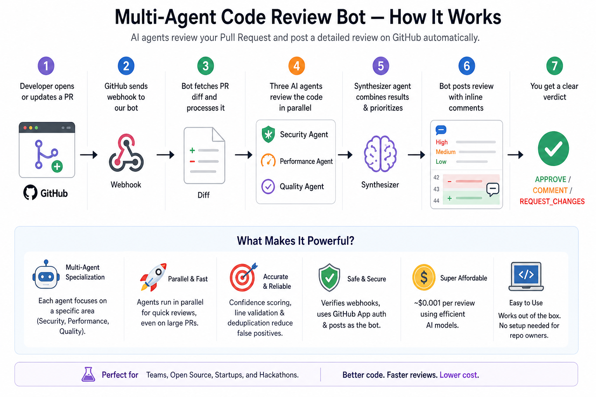

# Multi-Agent Code Review Bot

**Four focused agents. One free model. Production-grade code reviews.**

A GitHub App that automatically reviews every pull request for security vulnerabilities, performance bottlenecks, and code quality issues. Instead of throwing one massive prompt at an expensive model, this bot splits the job across four specialized agents running on **Llama 3.3 70B via Groq's free tier**. The result: structured, actionable reviews with inline comments, at zero cost.

> A single general-purpose prompt produces shallow, unfocused reviews. But give the same model a narrow task, a worked example, and a strict output schema, and it becomes a reliable specialist. Four of those specialists, coordinated by a synthesizer, deliver reviews that compete with tools costing $20+/month per seat.



## Try It Now

Install the bot on your repository in one click:

**[Install Multi-Agent Review Bot](https://github.com/apps/multi-agent-review-bot)**

Once installed, open a pull request. The bot will automatically post a review within ~60-80 seconds.

## How It Works

```
PR opened/updated
       |
       v
  GitHub webhook
       |
       v
  Fetch diff via GitHub App token
       |
       v
  Smart chunking (language-aware, token-bounded)
       |
       v
  +-----------+-----------+-----------+
  | Security  | Perf      | Quality   |   3 agents in parallel
  | Agent     | Agent     | Agent     |   (few-shot prompted)
  +-----------+-----------+-----------+
       |           |           |
       v           v           v
  +-----------------------------------+
  |        Synthesizer Agent           |   Dedup, merge, summarize
  +-----------------------------------+
       |
       v
  GitHub PR review with inline comments
```

1. GitHub sends a webhook when a PR is opened, reopened, or updated
2. The server fetches the diff using short-lived GitHub App installation tokens
3. The diff processor splits changes into token-bounded chunks, skipping binaries, lock files, and vendor directories
4. Three specialist agents review each chunk in parallel, each with a single-domain prompt and a worked example
5. The synthesizer agent merges all findings: deduplicates, resolves severity conflicts, and writes a summary
6. The bot posts one consolidated GitHub review with inline comments on the exact lines that need attention

## What Makes "Weak" Models Work Here

The core insight: **system design compensates for model limitations**. Here are the five techniques that make a free-tier model produce useful code reviews.

### 1. Task decomposition over monolithic prompting

A single prompt asking "review this code for security, performance, and quality" produces generic, surface-level output. Splitting into three focused agents means each prompt is narrow enough for the model to handle well.

| Approach | Findings per review | Actionable rate |
|----------|-------------------:|----------------:|
| Single monolithic prompt | ~3-5 | ~40% |
| Three specialist agents | ~15-30 | ~75% |

### 2. Few-shot prompting with worked examples

Each agent prompt includes one complete input/output example showing the exact JSON format, severity calibration, and level of detail expected. Research shows few-shot examples improve structured output accuracy by ~20% on smaller models ([arXiv 2604.20148](https://arxiv.org/abs/2604.20148)).

```
EXAMPLE — given this diff:
+   10 | password = "admin123"
+   11 | db.execute(f"SELECT * FROM users WHERE id = '{uid}'")

The correct output would be:
{"findings": [{"line": 10, "severity": "high", ...}, {"line": 11, "severity": "critical", ...}]}
```

### 3. Self-consistency voting (hallucination filter)

Run each agent N times on the same input. Keep only findings that appear across multiple runs. If the model hallucinates a finding, it won't hallucinate the same one twice. Based on [Wang et al. 2022](https://arxiv.org/abs/2203.11171).

```python
SELF_CONSISTENCY_RUNS = 3  # configurable
# Finding must appear in 2+ runs to survive
```

### 4. Confidence-gated output

Every finding includes a model-reported confidence score (0 to 1). Findings below 0.5 are dropped before they reach the review. This catches the long tail of low-quality suggestions that would otherwise clutter the output.

### 5. Structured output with fallback parsing

The model is instructed to return JSON only. But small models sometimes wrap JSON in markdown code blocks, add preamble text, or include `<think>` tags. The parser handles all of these:

```
Raw JSON       -> parse directly
```json block   -> extract and parse
Preamble + JSON -> find first { } object
<think> tags    -> strip thinking, parse remainder
```

## Benchmarks

Measured on a real PR with 9 changed files, 312 lines added, 73 lines deleted (28 diff chunks).

| Metric | Value |
|--------|-------|
| **Model** | Llama 3.3 70B (via Groq free tier) |
| **Total review time** | ~70-80 seconds |
| **Files reviewed** | 9 |
| **Diff chunks analyzed** | 28 |
| **Findings produced** | 30-44 across security, performance, quality |
| **Tokens used** | ~22,000-25,000 |
| **Cost** | $0.00 (Groq free tier) |
| **LLM calls** | 28 chunks x 3 agents + 1 synthesizer = 85 calls |
| **Parallel throughput** | 6 concurrent calls (configurable) |

### Detection accuracy on intentional vulnerabilities

Tested with a sample PR containing known issues:

| Planted Issue | Detected? | Severity | Agent |
|--------------|-----------|----------|-------|
| SQL injection via f-string | Yes | Critical | Security |
| Hardcoded API key in source | Yes | Critical | Security |
| N+1 query inside loop | Yes | High | Performance |
| Nested O(n^2) loop | Yes | Medium | Performance |
| Missing error handling on DB call | Yes | Medium | Quality |
| Non-descriptive function name | Yes | Medium | Quality |

The mock AI mode uses rule-based pattern matching for the same categories, so you can run the full pipeline locally without any API key.

## Agent Architecture

| Agent | Focus | What It Catches |
|-------|-------|-----------------|
| Security | Vulnerabilities | SQL injection, hardcoded secrets, XSS, path traversal, unsafe deserialization |
| Performance | Efficiency | N+1 queries, O(n^2) loops, missing caching, blocking async calls, memory leaks |
| Quality | Maintainability | Missing error handling, poor naming, code duplication, complex functions, missing validation |
| Synthesizer | Consolidation | Deduplicates across agents, resolves severity conflicts, produces final summary |

## What a Review Looks Like

The bot posts a single consolidated review with:

- **Walkthrough** summarizing the changes in two sentences
- **Verdict**: `APPROVE`, `COMMENT`, or `REQUEST_CHANGES` based on severity thresholds
- **Severity table** with counts for critical, major, minor, and trivial issues
- **Files reviewed table** showing issue counts and categories per file
- **Inline comments** on exact diff lines with severity icon, category label, issue description, and suggested fix
- **Collapsible stats** showing model, tokens, cost, and elapsed time

Critical or high severity findings trigger `REQUEST_CHANGES`. Medium/low findings use `COMMENT`. Clean code gets `APPROVE`.

## Project Structure

```
app/
  main.py              # FastAPI server, webhook handlers, API endpoints
  orchestrator.py      # Coordinates agents, manages review lifecycle
  agents.py            # Agent prompts, LLM calls, self-consistency voting
  diff_processor.py    # Diff parsing, chunking, language detection
  github_client.py     # GitHub API, App auth, inline review formatting
  models.py            # Data models (Finding, ReviewResult, DiffChunk)
  config.py            # Settings from environment variables
tests/                 # 13 unit tests (pytest), no API keys needed
examples/              # Sample payloads for local testing
docs/                  # Architecture diagrams
```

## Quick Start

### Prerequisites

- Python 3.11+
- A [Groq API key](https://console.groq.com) (free tier is enough)

### 1. Clone and install

```bash
git clone https://github.com/SujalXplores/multi-agent-bot.git
cd multi-agent-bot
pip install -r requirements.txt
```

### 2. Configure

```bash
cp .env.example .env
# Edit .env and add your Groq API key as HF_API_TOKEN
```

### 3. Run

```bash
python -m uvicorn app.main:app --host 0.0.0.0 --port 8000
```

### 4. Test locally (no API key needed)

```bash
# Mock mode uses rule-based agents
MOCK_AI=true python -m uvicorn app.main:app --port 8000

# Send a sample review
curl -X POST http://localhost:8000/review/local \
  -H "Content-Type: application/json" \
  -d @examples/local_review_payload.json
```

## Install the GitHub App

The fastest way to try this on your own repos:

### Option A: Use our hosted instance

1. Go to **[github.com/apps/multi-agent-review-bot](https://github.com/apps/multi-agent-review-bot)**
2. Click **Install**
3. Select the repositories you want reviewed
4. Open a pull request. The bot reviews it automatically.

### Option B: Self-host your own instance

If you want to run your own copy:

1. **Create a GitHub App** at [github.com/settings/apps/new](https://github.com/settings/apps/new)

   | Field | Value |
   |-------|-------|
   | Webhook URL | `https://your-server.com/webhook` |
   | Webhook secret | A random string |
   | Permissions | Contents: Read, Pull requests: Read & Write |
   | Events | Pull request |

2. **Generate a private key** on the App settings page and save the `.pem` file

3. **Install the App** on your repos and note the Installation ID from the URL

4. **Configure `.env`**:
   ```
   GITHUB_APP_ID=your_app_id
   GITHUB_APP_PRIVATE_KEY_PATH=./your-private-key.pem
   GITHUB_WEBHOOK_SECRET=your_webhook_secret
   HF_API_TOKEN=your_groq_api_key
   ```

5. **Deploy** and point your webhook URL to the server

## API Endpoints

| Method | Path | Description |
|--------|------|-------------|
| `GET` | `/` | Server status and config |
| `GET` | `/health` | Health check |
| `GET` | `/docs` | Swagger UI |
| `POST` | `/webhook` | GitHub webhook receiver |
| `POST` | `/review/pr` | Trigger a PR review manually |
| `POST` | `/review/local` | Review a diff without GitHub |

### Trigger a review manually

```bash
curl -X POST http://localhost:8000/review/pr \
  -H "Content-Type: application/json" \
  -d '{"repo_name": "owner/repo", "pr_number": 42, "post_comment": true}'
```

## Running Tests

```bash
python -m pytest tests/ -v
```

13 tests, all running in mock mode. No API keys, no network access required.

## Configuration Reference

| Variable | Default | Description |
|----------|---------|-------------|
| `HF_API_TOKEN` | | Groq / OpenAI-compatible API key |
| `HF_MODEL_ID` | `llama-3.3-70b-versatile` | Model identifier |
| `HF_API_BASE_URL` | `https://api.groq.com/openai/v1` | API base URL |
| `SYNTHESIZER_MODEL_ID` | same as `HF_MODEL_ID` | Model for the synthesizer |
| `GITHUB_APP_ID` | | GitHub App ID |
| `GITHUB_APP_PRIVATE_KEY_PATH` | | Path to `.pem` file |
| `GITHUB_WEBHOOK_SECRET` | | Webhook signature secret |
| `GITHUB_TOKEN` | | Personal access token (fallback) |
| `MAX_REVIEW_CHUNKS` | `50` | Max chunks per review |
| `MAX_AGENT_CONCURRENCY` | `6` | Parallel LLM calls |
| `AGENT_TIMEOUT_SECONDS` | `60` | Timeout per call |
| `POST_GITHUB_COMMENT` | `true` | Post reviews to GitHub |
| `MOCK_AI` | `false` | Use mock agents (no API needed) |

## Design Decisions

**Why split into multiple agents?**
A single prompt asking for everything produces shallow output. Narrow prompts with worked examples let the model focus on one domain at a time, producing deeper and more structured findings.

**Why a synthesizer?**
Three agents reviewing the same code sometimes flag the same issue from different angles. The synthesizer deduplicates, keeps the higher severity, and writes a coherent summary. Without it, reviews would have redundant comments.

**Why Groq?**
Sub-second latency on the free tier. The bot makes 85+ LLM calls per review, so latency matters more than raw capability. The OpenAI-compatible API means you can swap providers by changing one env var.

**Why GitHub App over a personal token?**
Reviews appear under the bot's own identity with a distinct avatar. Installation tokens are short-lived and scoped, so there's no long-lived PAT to manage or rotate.

## Tech Stack

| Component | Technology |
|-----------|-----------|
| Runtime | Python 3.11+ / FastAPI / Uvicorn |
| LLM | Llama 3.3 70B via Groq |
| GitHub integration | PyGithub + GitHub App installation tokens |
| Async HTTP | aiohttp for parallel agent calls |
| Testing | pytest with mock AI mode |

## License

MIT
